## CONNECT FOUR

## IN ENGLISH :gb:
#### @author: @Bluz0 @Ewilanstr

### Game created in Java with Swing

### Class: Board

First, we created a Board class to model a game board with a specific number of columns and rows using the paintComponent method.
 
To draw the board, we need to define the rows and columns. We retrieve a width, a height, and the x and y coordinates to place our piece in the correct position.
 
Code of the paintComponent method from the Board class: 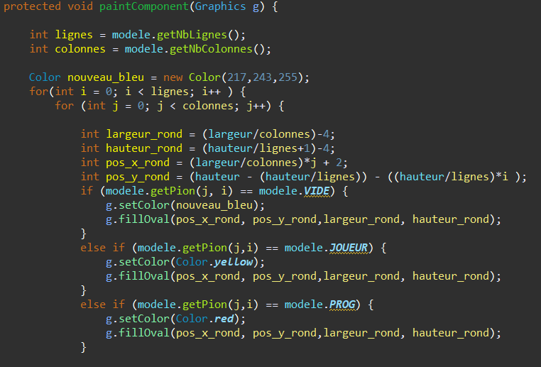 
As we can see, if the model is empty, our board will consist of empty pieces. Depending on the player's choice, their piece will be placed in the desired position.
 
Result:
 
Class: GridButton

The GridButton class allows the creation of a row of buttons to insert pieces based on the clicked button.
 
We also implement the PropertyChangeListener interface in this JPanel to update the number of buttons when the number of columns changes.
 
Using a loop, we add a button for each column and assign a listener to these buttons to create an action when clicked (InsertListener).
 
For a default column count of 7, we create 7 buttons:
 

### Class: InsertListener

By implementing ActionListener and its actionPerformed method, each time a button is clicked, we select the column, check if it's possible to play, and verify if the game is over.
 
By clicking on the third button from the left, we see that our piece is placed. We also notice that the program immediately places its piece.
 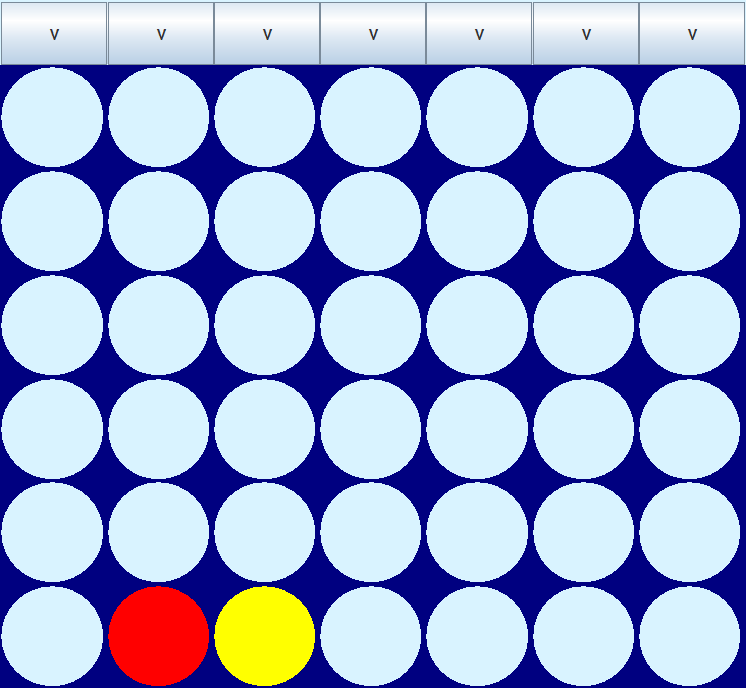

### Class: DisplayResult

The DisplayResult class is a JPanel that shows the final result. The winner can be either the player or the program.
 
The panel refreshes as long as the game is not over. If the player decides to continue playing after the game has ended, the board stops refreshing.
 
If the program wins, a red background and a message appear:
 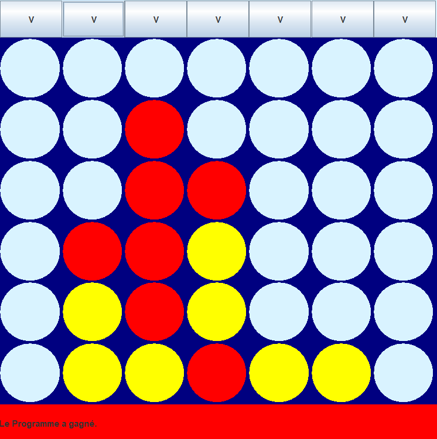 
The same process applies when the player wins:
 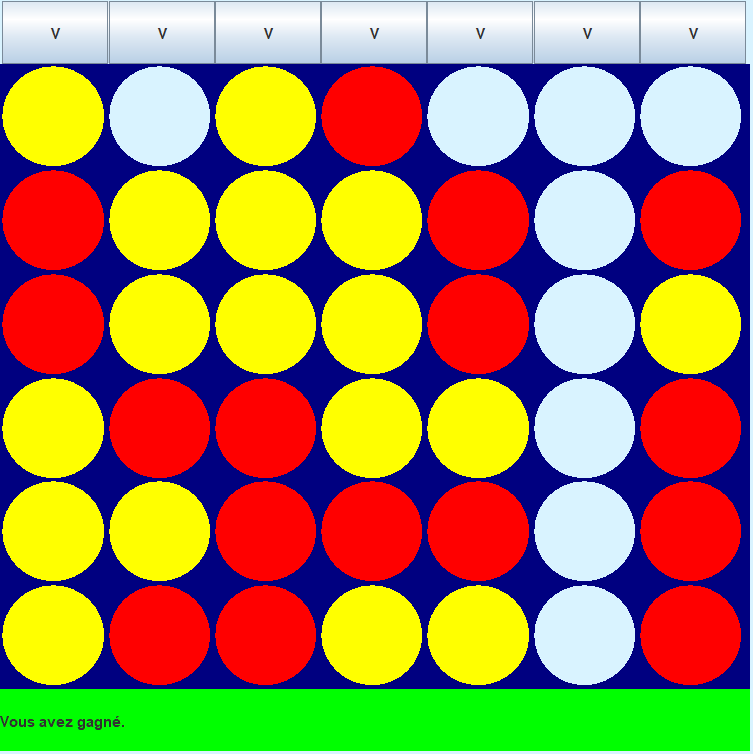 
The result changes in the propertyChange method.

### Class: BoardCanvas

This class groups the three JPanels: GridButtons, Board, and DisplayResult into a single JPanel.
 
In our constructor, we add these JPanels and update the model in the DisplayResult and GridButtons classes using "modele.addPropertyChangeListener(param)".

### Class: MouseClick

This class allows playing the game without clicking on the buttons. Now, we can play by clicking directly on the board in the desired column.
 
We retrieve the number of columns using the mouse position, the board width, and the number of columns.
 
Players can now place their pieces by clicking on the board.

### Class: NewGame

The NewGame class is a JPanel containing a button (See Puiss4Frame class) that allows creating a new game by modifying the number of columns, rows, and difficulty level using data retrieved from JTextFields (See Puiss4Frame class).

### Class: Puiss4Frame

All these classes are useless without a window. In our constructor, a JPanel is added for each class.
 
For the NewGame class, we associate a button with the ActionListener: NewGame, which allows changing the number of columns, rows, and difficulty level in the model.
 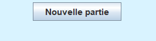 
However, this button will not work without retrieving the necessary data.
 
We then create three JLabels and three JTextFields with default values taken from the default game settings (columns: 7, rows: 6, difficulty level: 2).
 
Thanks to our JTextFields, our button is functional.
 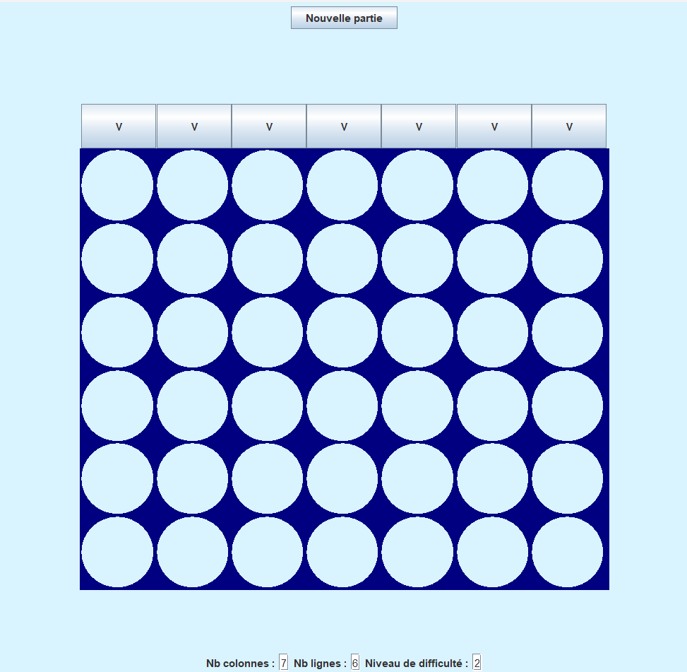 
By changing our JTextFields and clicking on New Game, our board updates to a 9x9 board:
 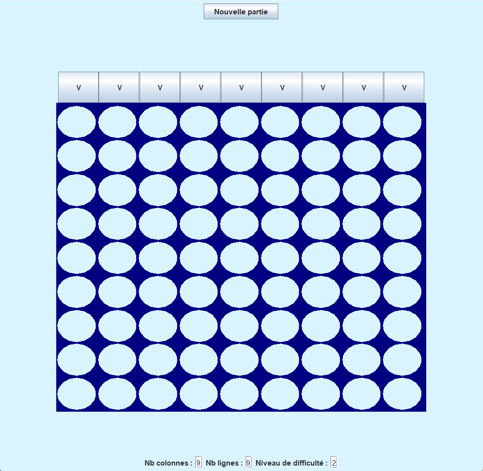

# Adding Save and Load Buttons

To add our two buttons, Save and Load, let's create these two classes: Save and Load.
## The Save Class

The Save class implements the Serializable and ActionListener interfaces, allowing us to click on a Save button.

After creating the Save constructor, which takes the Puiss4 model and a filename (String) as parameters, we add the actionPerformed method.

Inside this method, we use a try/catch block. In the try section, we use the ObjectOutputStream class to write objects to a file, along with the FileOutputStream class.

We write the game board to the file using the writeObject method.
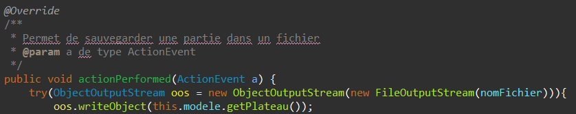
## The Load Class

The same principle applies to the constructor.

In the actionPerformed method, we use the same class, but this time in Input mode to load the saved file.

Further in the method, we use setText to modify the number of columns, rows, and difficulty level if they have been changed.
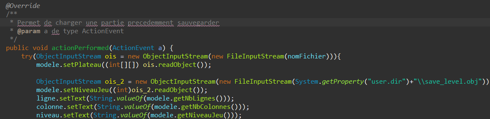 
Converting Them into Buttons

It is quite simple to turn these classes into buttons. We just need to go to our Puiss4Frame class, which contains our frame, and add JButtons to it.
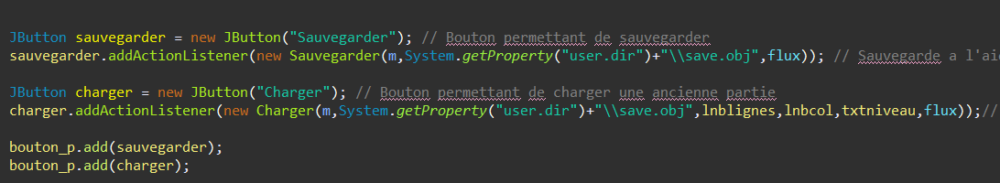 
## Demonstration:

The game state I just saved by clicking the button:
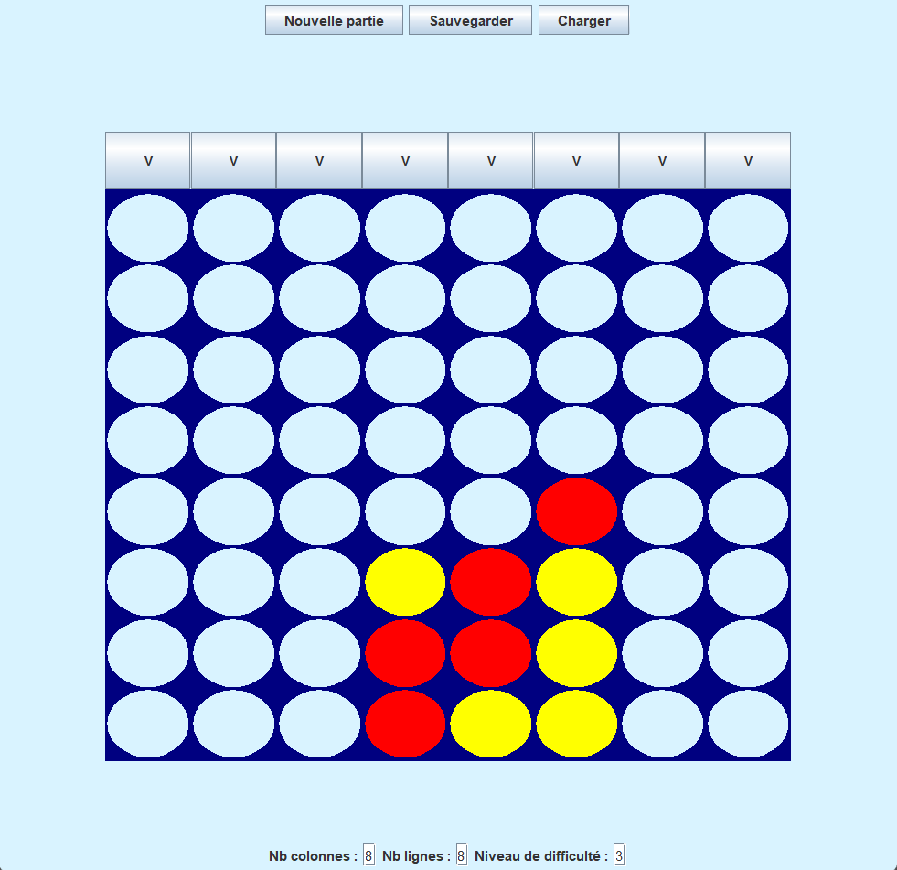

I decide to create a new game while changing the board dimensions:
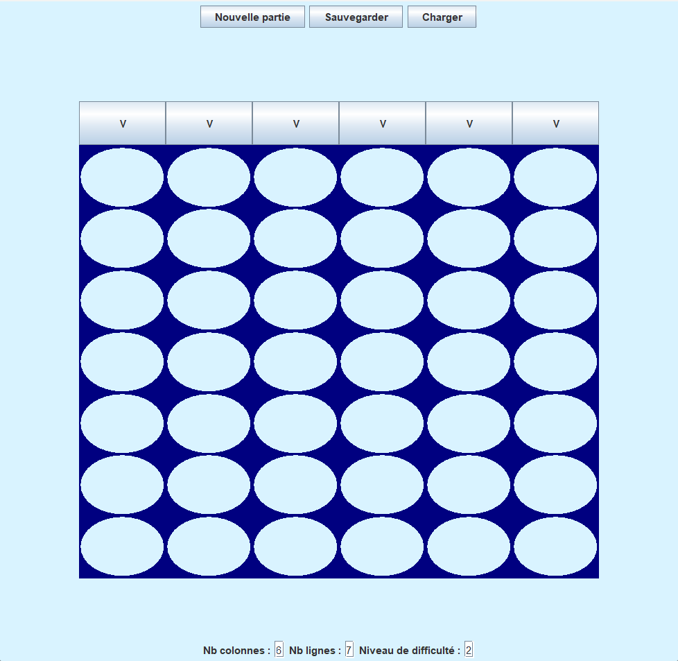

Then, I want to return to the previous game state by clicking Load. As we can see, our previous game with 8 columns, 8 rows, and a difficulty level of 3 has been restored.
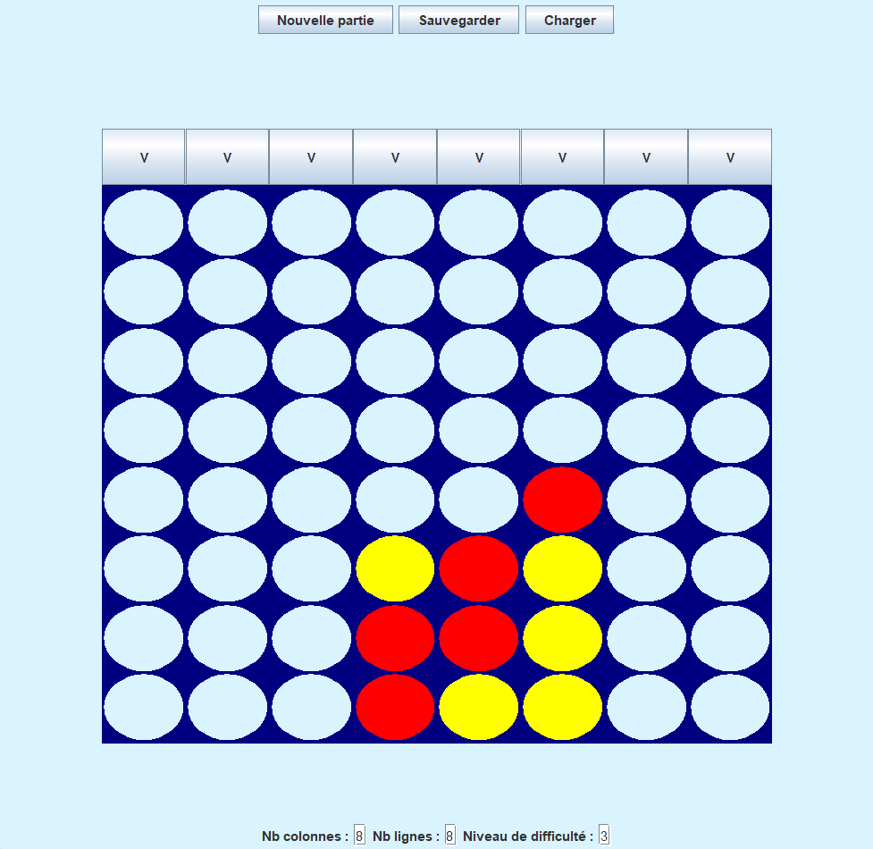
## The Logger Class

To implement a logging system, we need to create the Logger class.

We create the three required constructors:
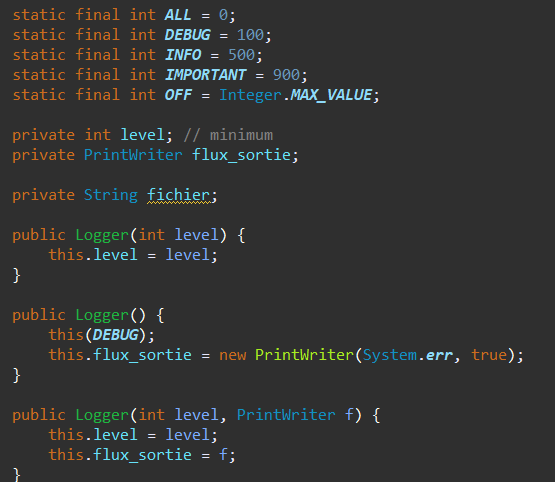

Then, we create the Log method, which displays a message along with its importance level.
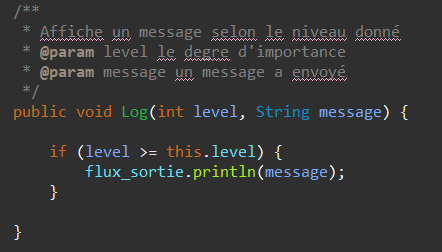

To make our Logger class usable, we need to integrate it into our other classes.

For example, to track which user clicks on which column, we simply create an instance of Logger and use its Log method.

Each message is associated with its importance level.
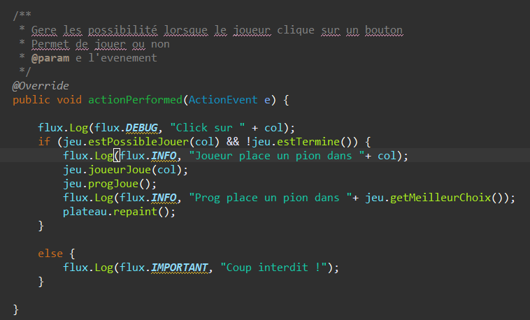

After implementing it in each class, we initialize it in our Puiss4Frame class:
Logger fl = new Logger();

As seen, each action generates a message in the console.
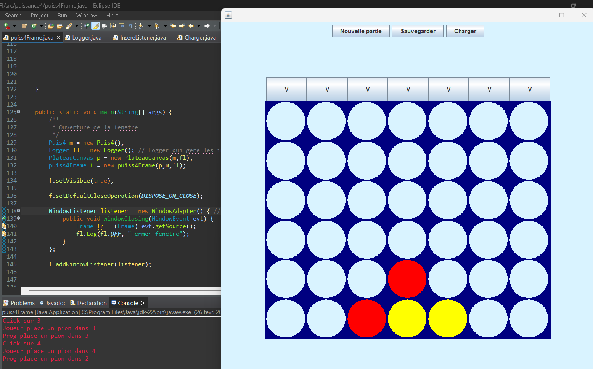

This also happens when closing the window.

To initialize the logging system by reading the logging configuration from a file, we need to use the Logger(String) constructor.

In this constructor, we read the file using FileReader, extracting only the first line of the given file.

We parse this file to extract the importance level (as a String) and the directory + file name.

Using the niveauDegreImportance method, which converts a string into a constant (INFO, DEBUG, etc.), and the gereFichier method, we can see how log outputs are managed.
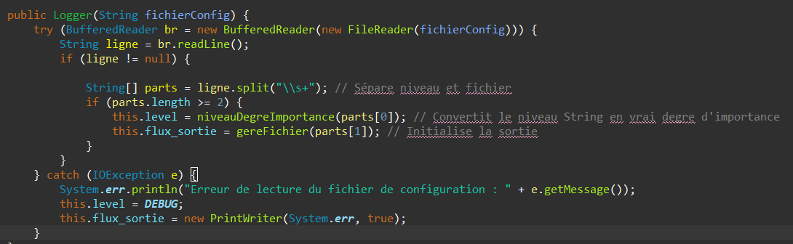

Then, in the main method of the Puiss4Frame class, we initialize our Logger as follows:
Logger fl = new Logger("config.txt");
Examples:

I decide to modify my config.txt file to store all necessary information in another file named touteInfo.txt.
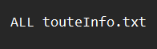

I play a game and close the window—each log entry has been written to touteInfo.txt.

Only INFO messages are displayed, which is why messages such as "Window Closed" or "The program has won" do not appear.
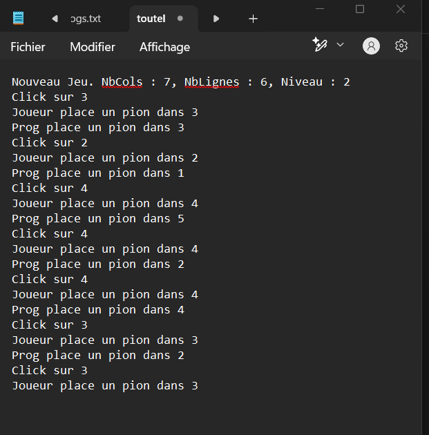

Another example with DEBUG: the messages will not be written to a file but displayed in the console if we specify System.err.
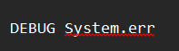 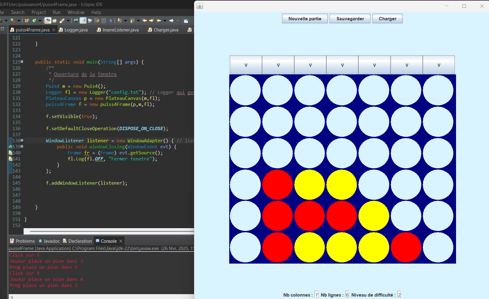

## PUISSANCE 4

## EN FRANCAIS :fr:
#### @auteurs : @Bluz0 @Ewilanstr

### Jeu crée en java avec swing

### Classe : Plateau

 Premierement, nous avons crée une classe Plateau permettant de modeliser un plateau de jeu par rapport a un nombre de colonnes et de lignes grace à la methode paintComponent.

 Pour dessiner le plateau, on doit delimiter les lignes et colonnes. On recupere une largeur, une hauteur et le x et y pour placer notre pion au bon endroit. 

Code de la methode paintComponent de la classe Plateau :

 Comme on peut le voir si le modele est vide , notre plateau sera composé de pions vides. Selon le choix du joueur, son pion se placera selon la position souhaité.

Résultat :

### Classe : GridBouton

La classe GridBouton permet de creer une ligné de boutons afin de pouvoir inserer nos pions selon le bouton cliqué.

 On implemente egalement dans ce JPanel l'interface PropertyChangeListener afin de pouvoir actualiser le nombre de boutons si le nombre de colonnes est changé.

A l'aide d'une boucle, on ajoute un bouton pour chaque colonne, et on attribut a ces boutons un listener afin de creer une action lorsque l'on clique dessus (InsereListener)

Pour un nombre de colonnes de 7 (par defaut), on crée 7 boutons

### Classe : InsereListener

Grace à l'implementation d'ActionListener et de sa methode actionPerformed, a chaque fois qu'un bouton est cliqué, on va selectionné la colonne et verifier si la il est possible de jouer et de verifier si le partie n'est pas fini

En cliquant sur le 3eme bouton en partant de la gauche, on constate que notre pion est posé. On constate egalement que le programme pose instantanement son pion.

### Classe : AfficheResultat

La classe AfficheResultat est un JPanel permettant de voir le resultat final, les gagnants peuvent etre le joueur ou le programme
 

Le panel se refraichit tant que le jeu ne se fini pas, si le joueur decide de continuer de jouer alors que le jeu est fini , le plateau cesse de se rafraichir

Si le programme gagne, un fond rouge et un texte s'affiche

Meme procedé pour la victoire du joueur

Le resultat change dans la methode propertyChange

### Classe : PlateauCanvas

Cette classe regroupe les trois JPanels : GridBoutons, Plateau et AfficheResultat en un Jpanel.

Dans notre constructeur on a bien evidemment l'ajout dans des JPanel mais il y a aussi l'actualisation du modele dans les classes AfficheResultat et GridBoutons : "modele.addPropertyChangeListener(param)".

### Classe SourisClick

Cette classe permet de jouer au jeu sans cliquer sur les boutons. On peut maintenant jouer en cliquant sur le plateau directement en cliquant sur la colonne voulu.

On recupere le nb colonnes à l'aide de la position de la souris, de la largeur du plateau et du nombre de colonnes.

On peut jouer en cliquant sur le plateau

### Classe NouvelleGame

La classe nouvelleGame est un JPanel comportant un bouton (Voir Classe puiss4Frame) permettant de creer un nouveauJeu en modifiant le nombre de colonnes , le nombre de lignes et le niveau de difficulté en recuperant dans des JTextField les informations necessaires (Voir Classe puiss4Frame)

### Classe Puiss4Frame

Toute ces classes sont inutiles sans fenetre , dans notre constructeur un jpanel est ajouté pour chaque classe.

Pour la classe NouvelleGame, on associe un bouton a l'ActionListener : NouvelleGame permettant de changer le nombre de colonnes , de lignes et le niveau de difficulté dans le modele

Mais ce bouton ne fonctionne pas sans recuperer nos données necessaires

On crée alors trois JLabel et trois JTextField avec comme valeur par defaut ceux du jeu par default (nb colonnes : 7, nb lignes : 6, niveau de difficulté : 2).

Grace a nos TxtField notre bouton est fonctionnel

En changeant nos jtxtfield puis en cliquant sur Nouvelle Partie, notre plateau se modifie en plateau 9x9 : 

# Ajout boutons sauvegarder et charger

 Pour ajouter nos deux boutons savegarder et charger, créeons ces deux classes : Sauvegarder et Charger. 

## La classe : Sauvegarder

 La classe Sauvegarder implemente les interfaces Serializable et ActionListener permettant de pouvoir cliquer sur un bouton Sauvegarder. 

 Apres avoir creer le constructeur Sauvegarder accompagné en parametre du modele Puis4 et un nom de fichier (String), on ajoute la methode actionPerformed. 

 Dans notre methode, on retrouve un try/catch, dans notre try on retrouve la classe ObjectOutputStream qui permet d’écrire des objets dans un fichier, accompagné du fichier FileOutputStream. 

 On ecrit dans ce meme fichier notre plateau à sauvegarder à l'aide de la méthode writeObject.

## La classe : Charger

 Meme principe concernant le constructeur

 Dans la méthode actionPerformed , meme classe à utiliser mais cette fois ci en Input pour charger le fichier sauvegarder.

 Plus loin on voit des setText pour modifier les nombres de colonnes , lignes, et niveau si ceux-ci ont été modifié.

## Les transformer en boutons

 Assez simple de transformer ces classes en boutons. Il suffit d'aller dans notre classe puiss4Frame qui contient notre frame et d'ajouter a cette meme frame des JButtons.

#### Demonstration :

 Partie que je viens de sauvegarder en cliquant sur le bouton

 Je decide de creer une nouvelle partie en changeant par ailleurs les dimensions du plateau 

 Par la suite je souhaite retourné a la partie precedente en cliquant sur charger, comme on le constate , notre partie avec un nombre de colonne de 8 , un nombre de lignes de 8 et un niveau de difficulté de 3 est revenue. 

## La classe : Logger

 Pour réaliser un système de traçage, il faut créer la classe Logger 

 On crée nos 3 constructeurs demandé 

 On crée par la suite la méthode Log, qui permet d'afficher un message accompagné du degré d'importance 

 Pour que notre classe Logger soit utilisable, il faut l'utiliser dans nos autres classe. 

Exemple : pour afficher savoir quel utilisateur clique sur quel colonne il suffit d'avoir notre instance logger et d'utiliser sa methode Log. 

Chaque message est accompagné de son degré d'importance. 

 Apres l'avoir implementé dans chaque classe, il faut l'initialisé dans notre classe Puiss4Frame. Logger fl = new Logger();

 Comme on le voit a chaque action, une information est affiché dans la console 

 Et ce, meme à la fermeture de la fenetre 

 Pour pouvoir initialiser le système précédent en lisant la configuration de "traçage" dans un fichier, il faut d'abord cette classe Logger(String) 

 Dans ce constructeur on lit le fichier à l'aide de FileReader, on decide de lire uniquement la premiere ligne de ce fichier donnée en parametre.

 On decoupe dans ce fichier le degre d'importance ( en string ) et le repertoire + fichier choisi. 

 A l'aide de notre methode niveauDegreImportance, qui nous permet de convertir un string en constante (INFO,DEBUG...etc) et de notre methode gereFichier. On peut voir comment les sorties sont gerée . 

 Par la suite dans notre main de la classe Puiss4Frame, on initialise notre Logger comme ceci : Logger fl = new Logger("config.txt"); 

### Exemples :

 Je décide de modifier mon fichier config.txt pour pouvoir mettre toutes les infos dont j'ai besoin dans un autre fichier nommé touteInfo.txt 

 Je joue une partie et decide de fermer la fenetre, chaque information a été écrite dans notre fichier touteInfo.txt 

 Il n'y a que les INFO qui sont affiché, c'est pour cela que les messages tel que Fermer Fenetre ou Le programme a gagné ne s'affichent pas 

 Autre exemple avec DEBUG, les messages ne s'afficheront pas dans un fichier mais dans notre console si on indique System.err 

