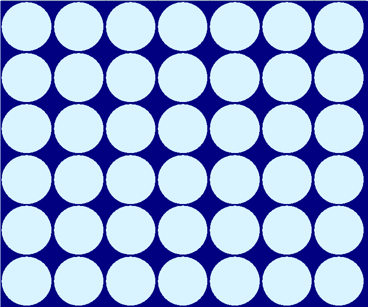

## PUISSANCE 4

## EN FRANCAIS :fr:
#### @auteurs : @Bluz0 @Ewilanstr

### Jeu crée en java avec swing

### Classe : Plateau

 Premierement, nous avons crée une classe Plateau permettant de modeliser un plateau de jeu par rapport a un nombre de colonnes et de lignes grace à la methode paintComponent.

 Pour dessiner le plateau, on doit delimiter les lignes et colonnes. On recupere une largeur, une hauteur et le x et y pour placer notre pion au bon endroit. 

Code de la methode paintComponent de la classe Plateau :

 Comme on peut le voir si le modele est vide , notre plateau sera composé de pions vides. Selon le choix du joueur, son pion se placera selon la position souhaité.

Résultat :

### Classe : GridBouton

La classe GridBouton permet de creer une ligné de boutons afin de pouvoir inserer nos pions selon le bouton cliqué.

 On implemente egalement dans ce JPanel l'interface PropertyChangeListener afin de pouvoir actualiser le nombre de boutons si le nombre de colonnes est changé.

A l'aide d'une boucle, on ajoute un bouton pour chaque colonne, et on attribut a ces boutons un listener afin de creer une action lorsque l'on clique dessus (InsereListener)

Pour un nombre de colonnes de 7 (par defaut), on crée 7 boutons

### Classe : InsereListener

Grace à l'implementation d'ActionListener et de sa methode actionPerformed, a chaque fois qu'un bouton est cliqué, on va selectionné la colonne et verifier si la il est possible de jouer et de verifier si le partie n'est pas fini

En cliquant sur le 3eme bouton en partant de la gauche, on constate que notre pion est posé. On constate egalement que le programme pose instantanement son pion.

### Classe : AfficheResultat

La classe AfficheResultat est un JPanel permettant de voir le resultat final, les gagnants peuvent etre le joueur ou le programme
 

Le panel se refraichit tant que le jeu ne se fini pas, si le joueur decide de continuer de jouer alors que le jeu est fini , le plateau cesse de se rafraichir

Si le programme gagne, un fond rouge et un texte s'affiche

Meme procedé pour la victoire du joueur

Le resultat change dans la methode propertyChange

### Classe : PlateauCanvas

Cette classe regroupe les trois JPanels : GridBoutons, Plateau et AfficheResultat en un Jpanel.

Dans notre constructeur on a bien evidemment l'ajout dans des JPanel mais il y a aussi l'actualisation du modele dans les classes AfficheResultat et GridBoutons : "modele.addPropertyChangeListener(param)".

### Classe SourisClick

Cette classe permet de jouer au jeu sans cliquer sur les boutons. On peut maintenant jouer en cliquant sur le plateau directement en cliquant sur la colonne voulu.

On recupere le nb colonnes à l'aide de la position de la souris, de la largeur du plateau et du nombre de colonnes.

On peut jouer en cliquant sur le plateau

### Classe NouvelleGame

La classe nouvelleGame est un JPanel comportant un bouton (Voir Classe puiss4Frame) permettant de creer un nouveauJeu en modifiant le nombre de colonnes , le nombre de lignes et le niveau de difficulté en recuperant dans des JTextField les informations necessaires (Voir Classe puiss4Frame)

### Classe Puiss4Frame

Toute ces classes sont inutiles sans fenetre , dans notre constructeur un jpanel est ajouté pour chaque classe.

Pour la classe NouvelleGame, on associe un bouton a l'ActionListener : NouvelleGame permettant de changer le nombre de colonnes , de lignes et le niveau de difficulté dans le modele

Mais ce bouton ne fonctionne pas sans recuperer nos données necessaires

On crée alors trois JLabel et trois JTextField avec comme valeur par defaut ceux du jeu par default (nb colonnes : 7, nb lignes : 6, niveau de difficulté : 2).

Grace a nos TxtField notre bouton est fonctionnel

En changeant nos jtxtfield puis en cliquant sur Nouvelle Partie, notre plateau se modifie en plateau 9x9 : 

## CONNECT FOUR

## IN ENGLISH :gb:
#### @author: @Bluz0 @Ewilanstr

### Game created in Java with Swing

### Class: Board

First, we created a Board class to model a game board with a specific number of columns and rows using the paintComponent method.
 
To draw the board, we need to define the rows and columns. We retrieve a width, a height, and the x and y coordinates to place our piece in the correct position.
 
Code of the paintComponent method from the Board class:  
As we can see, if the model is empty, our board will consist of empty pieces. Depending on the player's choice, their piece will be placed in the desired position.
 
Result:
 
Class: GridButton

The GridButton class allows the creation of a row of buttons to insert pieces based on the clicked button.
 
We also implement the PropertyChangeListener interface in this JPanel to update the number of buttons when the number of columns changes.
 
Using a loop, we add a button for each column and assign a listener to these buttons to create an action when clicked (InsertListener).
 
For a default column count of 7, we create 7 buttons:
 

### Class: InsertListener

By implementing ActionListener and its actionPerformed method, each time a button is clicked, we select the column, check if it's possible to play, and verify if the game is over.
 
By clicking on the third button from the left, we see that our piece is placed. We also notice that the program immediately places its piece.
 

### Class: DisplayResult

The DisplayResult class is a JPanel that shows the final result. The winner can be either the player or the program.
 
The panel refreshes as long as the game is not over. If the player decides to continue playing after the game has ended, the board stops refreshing.
 
If the program wins, a red background and a message appear:
  
The same process applies when the player wins:
  
The result changes in the propertyChange method.

### Class: BoardCanvas

This class groups the three JPanels: GridButtons, Board, and DisplayResult into a single JPanel.
 
In our constructor, we add these JPanels and update the model in the DisplayResult and GridButtons classes using "modele.addPropertyChangeListener(param)".

### Class: MouseClick

This class allows playing the game without clicking on the buttons. Now, we can play by clicking directly on the board in the desired column.
 
We retrieve the number of columns using the mouse position, the board width, and the number of columns.
 
Players can now place their pieces by clicking on the board.

### Class: NewGame

The NewGame class is a JPanel containing a button (See Puiss4Frame class) that allows creating a new game by modifying the number of columns, rows, and difficulty level using data retrieved from JTextFields (See Puiss4Frame class).

### Class: Puiss4Frame

All these classes are useless without a window. In our constructor, a JPanel is added for each class.
 
For the NewGame class, we associate a button with the ActionListener: NewGame, which allows changing the number of columns, rows, and difficulty level in the model.
  
However, this button will not work without retrieving the necessary data.
 
We then create three JLabels and three JTextFields with default values taken from the default game settings (columns: 7, rows: 6, difficulty level: 2).
 
Thanks to our JTextFields, our button is functional.
  
By changing our JTextFields and clicking on New Game, our board updates to a 9x9 board:
 
